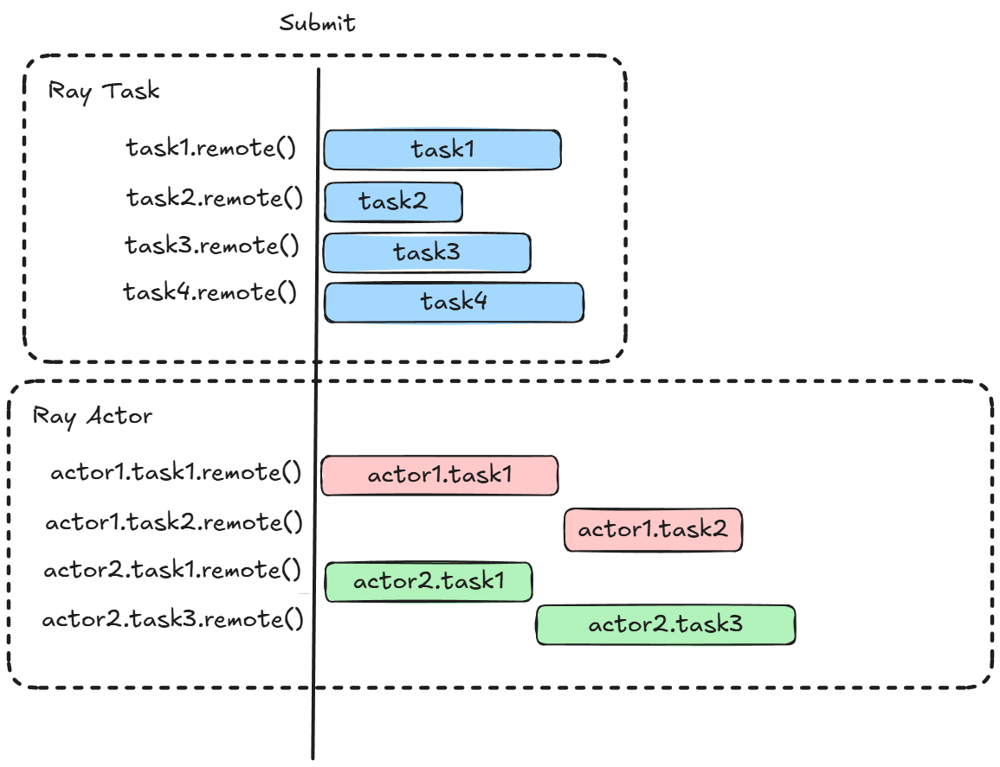
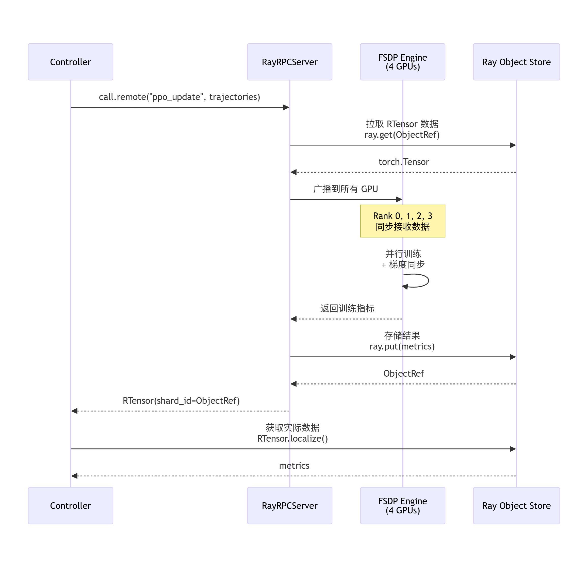

# Ray in AReaL
<details>
<summary>Ray的一些基础知识，如果不了解可以点开看看</summary>
Ray 是个很好用的分布式计算框架，接口非常简单。现在的RL框架，像VeRL，AReal都用了Ray来做分布式实现。记录一下Ray的一些基础，以及现在主流的RL框架都是怎么用Ray的。

## Ray Core

先来初始化
```PYTHON
ray.init()
```
Ray 的核心就是这个装饰器：
```python
@ray.remote
```
把它往函数或类上一贴，普通代码就变成分布式的。

## Task：一次性的计算任务
Task 是无状态的，可以把它想象成快递员送包裹——每次任务的输入都是不可变的（immutable），任务之间互不影响。
好处是啥？ 出错了可以随时重试，因为不依赖其他任务，所以可以在任意时刻重新启动。
定义一个 Task 很简单，在函数上贴个 `@ray.remote` 就行：

```python
@ray.remote
def add(x, y):
	return x + y
	
object_ref = add.remote(2, 5)
assert ray.get(object_ref) == 7
```
注意：add.remote() 立马就返回了（非阻塞），返回的是个 ObjectRef（可以理解成"取货单"），真正的计算在后台跑。

## Actor：有状态的计算服务
跟 Task 不同，Actor 用来表示有状态的计算任务。你可以把它想象成一个长期运行的服务员，会记住之前做过的事儿。

定义 Actor 也很简单，在 class 上贴 `@ray.remote`：

```python
# 定义
@ray.remote
class Counter(object):
    def __init__(self):
        self.value = 0

    def increment(self):
        self.value += 1
        return self.value
# 初始化 class.remote()
counter = Counter.remote()

refs = []

for i in range(10):
    ref = counter.increment.remote()
    refs.append(ref)

for i, ref in enumerate(refs):
    assert ray.get(ref) == i + 1
```

Task vs Actor：并行执行的区别
这里有个关键的区别：

- Task 提交：所有任务会被同时 schedule，并行执行
- Actor 调用：虽然提交也是非阻塞的，但方法调用会串行执行（一个接一个来）
为啥 Actor 不能并行？ 我个人认为是因为 Actor 有内部状态，如果多个方法同时执行，可能会互相干扰导致状态混乱。比如上面的 Counter，如果两个 increment() 同时跑，self.value 的值就不对了。


</details>

## AReaL 里是怎么用 Ray 的

AReaL 把每一张 GPU 抽象成一个“分布式执行单元”，而 RayRPCServer 就是这个执行单元的控制接口。每一个GPU上都会有一个这样的Woker来负责处理由controller 发起的一些操作，这些Worker可能作为TrainEngine/InferenceEngine的一部分。


```
Controller
   |
   |  RPC
   v
[ RayRPCServer / GPU0 ] ←→ NCCL ←→ [ GPU1 ]
[ RayRPCServer / GPU2 ]
[ RayRPCServer / GPU3 ]

```

在 Single Controller Mode 下，Controller 并不直接和 GPU 里的模型或 NCCL 进程通信，而是通过这些 RayRPCServer Worker 间接控制每一张 GPU 上的执行。

在这样的架构下，一个最核心的问题是：
> 当 Controller 调用远程引擎（比如做一次 forward / train step）时，Tensor 应该如何在这些 GPU 执行单元之间传递？


这里AReaL引入了`RTensor`这样一个抽象，RTensor可以认为是分布式Tensor的一个句柄：

> RTensor = layout + shards + backend

也就是说RTensor并不持有数据，而是描述了这个Tensor是存储在哪里，以及如何获取的接口，某种程度上可以认为是一个分布式张量的指针。可以通过`localize()` 来de-refernece来获取到真正的torch.Tensor。这个RTensor可以通过RPC进行传递，也可以通过broadcast向model parallel group进行广播。

> **Why RTensor**
> 
> 直接在 Ray RPC 中传 torch.Tensor 必须做序列化拷贝，不管是否需要，而 RTensor 允许 AReaL 把“控制面”和“数据面”解耦，让 NCCL 只在 GPU 之间跑，而 Ray 只负责路由和存储。
> 举个例子：Controller 先让 Worker A 生成了一个很大的Tensor，让后要把这个Tensor 传递给Worker B进行处理，这里如果直接每次RPC 返回，链路就是 A --> Controller --> B，而RTensor只需要调用localize 就可以直接从 A --> B进行传输，甚至如在同一个node可以直接不需要数据传输

RTensor 是一个抽象接口，它并不关心底层张量是怎么存的。在 Ray 模式下，AReaL 提供了一个实现：RayTensorBackend，它把脏活累活都交给了 Ray 的 Object Store
来看看 RayTensorBackend 的实现：

```python
class RayTensorBackend:
    """Ray Object Store 后端实现"""

    def store(self, tensor: torch.Tensor) -> ray.ObjectRef:
        """把张量存到 Ray Object Store"""
        return ray.put(tensor)  # 返回一个 ObjectRef（相当于指针）

    def fetch(self, shards: list[TensorShardInfo]) -> list[torch.Tensor]:
        """从 Ray Object Store 拉张量"""
        return ray.get([s.shard_id for s in shards])  # Ray 自动帮你找数据在哪

    async def delete(self, _node_addr: str, shard_ids: list[ray.ObjectRef]) -> None:
        """释放 Object Store 里的对象"""
        ray.internal.free(shard_ids)  # node_addr 没用上（下划线表示忽略）
```

这里`store`直接返回了ObjectRef，这样通过`ray.get`，在其他process中就可以直接获取实际的tensor，ray会根据上是否在同一node来决定是否要进行数据传输。

> Ray ObjectRef 就是 RTensor 的“物理指针”，
>
> Ray Object Store 就是 AReaL 的“分布式内存池”。

因为 Ray 的 ObjectRef 本身就带着位置信息，所以在 RayRPCServer 里创建 RTensor 的时候，node_addr 参数直接传空字符串就行：
 
```python
def call(self, method: str, *args, **kwargs) -> Any:
    # ...执行引擎方法...

    # 传空字符串，因为 Ray 会自动处理位置信息
    layout = RTensor.extract_layout(
        result,
        layouts=dict(args=raw_args, kwargs=raw_kwargs),
        node_addr="",  # 空字符串占位符
    )

    result = RTensor.remotize(
        result,
        layout,
        node_addr="",  # Ray ObjectRef 已经包含位置信息了
    )
    return result  # 直接返回，Ray 会自动序列化
```


从这一点开始，RayRPCServer.call() 的逻辑就不再是“远程函数调用”的实现细节，而是一套分布式张量执行协议。

## 远程调用的完整流程

首先我们对一个远程引擎调用了一个方法：

```python
result = engine.ppo_update(*args, **kwargs)
```

这里会通过RPC把args 和kwargs 传送到RPCServer中，这里传输的一般是RTensor，其中只包含了metadata，通过`RTensor.from_batched()`可以看到data实际上是个空壳。

```python
@classmethod
def from_batched(
    cls, batch_tensor: torch.Tensor, layout: RTensor, node_addr: str
) -> RTensor:
    ...
    return cls(shards=shards, data=batch_tensor.to("meta"))
```

它本质上实现的是一个 SPMD 风格的函数调用：一次从Controller发起 的 RPC 调用，会在一个由多张 GPU 组成的并行执行域中同步触发，并产生一个分布式张量作为返回值。

下面的流程图表示了一次FSDP做ppo_update的序列：




<details>
<summary>RayRPCServer.call 代码</summary>

```python
def call(self, method: str, *args, engine_name: str | None = None, **kwargs) -> Any:

    # ===== 1. 搞清楚要调哪个引擎 =====
    if engine_name is None:
        engine_name = self._default_engine_name
    engine = self._engines[engine_name]

    # ===== 2. 先把原始参数存一份（后面提取 layout 要用）=====
    raw_args = list(args)
    raw_kwargs = kwargs.copy()

    # ===== 3. 把远程张量拉到本地（如果输入里有 RTensor 的话）=====
    args = RTensor.localize(raw_args)      # RTensor → torch.Tensor
    kwargs = RTensor.localize(raw_kwargs)  # 从 Ray Object Store 拉数据

    # ===== 4. FSDP 广播（只针对 TrainEngine）=====
    if isinstance(engine, TrainEngine) and engine.initialized:
        # 确保所有 GPU 看到一样的输入
        raw_args = broadcast_tensor_container(
            tensor_container_to(raw_args, device),
            src_rank=engine.current_data_parallel_head(),
            group=engine.context_and_model_parallel_group,
        )
        # args, kwargs 也要广播...

    # ===== 5. 真正调用引擎的方法 =====
    fn = getattr(engine, method)
    result = fn(*args, **kwargs)

    # ===== 6. 如果是异步的，等它执行完 =====
    if isinstance(result, Future):
        result = result.result()  # 阻塞等待

    # ===== 7. 提取 layout 并把结果变成远程张量 =====
    layout = RTensor.extract_layout(
        result,
        layouts=dict(args=raw_args, kwargs=raw_kwargs),
        node_addr=""  # Ray 模式下传空字符串就行
    )

    if layout is not None:
        result = RTensor.remotize(result, layout, node_addr="")
        # torch.Tensor → RTensor（存到 Ray Object Store）

    # ===== 8. 模拟 RPC 序列化（挪到 CPU 上）=====
    result = tensor_container_to(result, "cpu")

    return result
```
</details>

所以我们其实可以看到，这样的设计带来了几个非常实用的好处。RTensor 把“张量是什么”和“张量在哪里”这两件事彻底分离：RTensor本身作为句柄被传递到各种地方，用于计算逻辑控制；后者则完全交给 Ray Object Store 作为数据流去处理。AReaL 不再需要自己维护复杂的节点路由和数据拷贝逻辑，就能自然获得 node 内 zero-copy、跨节点高效传输以及 Ray 提供的容错与生命周期管理。
